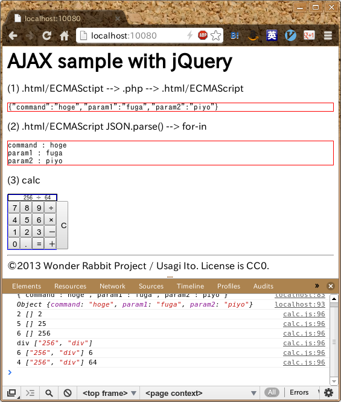

# AJAX sample with jQuery

## これなーに

とある学生たちのチームのプロジェクト演習のヘルプとしてでっちあげたAJAXするさんぷる。

## 要件

- httpd(Apache2とか)で
- php(5.4可)をつこうて
- ウェブブラウザーベースの
- ちょっとしたアプリに応用できそうなAJAXのサンプルつくれ
- サーバーサイドで計算する電卓もおまけでよろしくオナシャス！

…とかそういう感じのヘルプ依頼があって作ったでござる。

## このサンプルの試し方

1. `php -S 0.0.0.0:10080` して、
2. ウェブブラウザーでアクセス
3. 電卓を叩きながらウェブサーバーのログを見れ

## Copyright and License

好きに使うが良い。

&copy;2013 Wonder Rabbit Project / Usagi Ito. License is CC0
